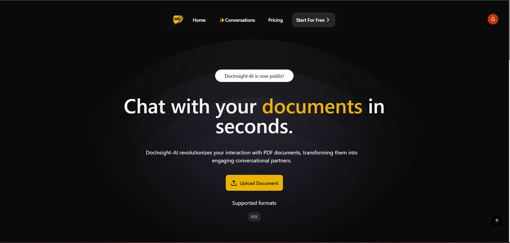
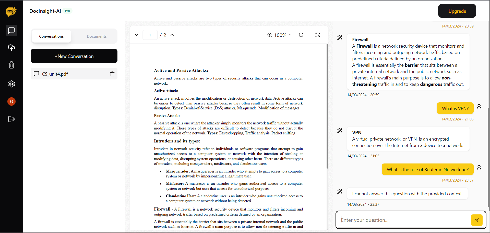

# DocInsight-AI - Chat with your PDF in seconds.

## Getting Started 🚀

Simplify Complex Documents, Save Time ⌚, and Chat Your Way to Clarity with DocInsight-AI - Your Ultimate 😎 Document Companion!
Sign up and get started, Today!



## Document upload ⬆️

Upload your PDF file either using drop 'n' drop or PDF url, and start your exciting journey with DocInsight-AI.


## Chat 💬 with your PDF

After uploading your PDF, you can start asking whatever you want.
<b>Note:</b> If you ask question out of context (i.e., the content is not present in your PDF), then you will not get the respective answer.



## Installation ⏬

Want to setup your own?
First, run the development server:

```bash
npm run dev
# or
yarn dev
# or
pnpm dev
```

Open [http://localhost:3000](http://localhost:3000) with your browser to see the result.

You can start editing the page by modifying `app/page.tsx`. The page auto-updates as you edit the file.
